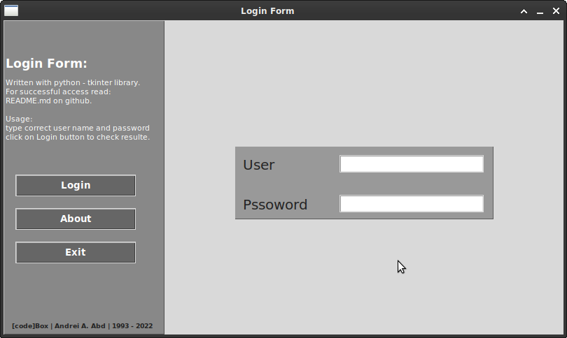

# **Login Form**

> **Inroduction :**

simple login form, written and designed with python **GUI** - tkinter Module.



---
> **Usage :**

- clone repo:

```git clone https://github.com/codeBOX-projects/loginform.git && cd loginform```

- run:

```python3 loginForm.py```

---
> **Successful login :**

```!
username : codeBOX
password : @123@123
```

> **Support distrabution:**

**Linux OS.**

**Windows OS.**

---
> ***[code]BOX*** | ***Andrei A.Abd*** | ***1993 - 2022***
